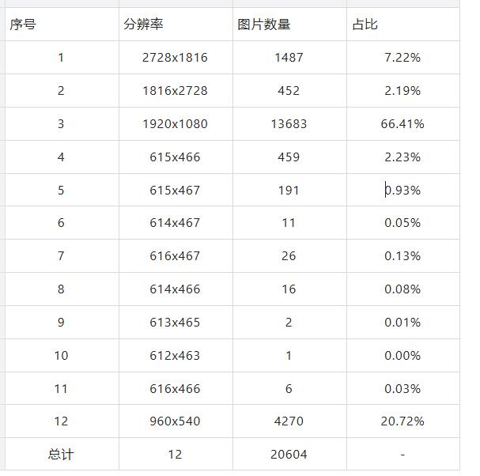
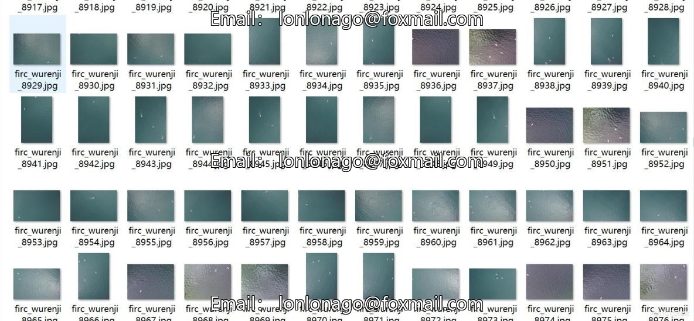
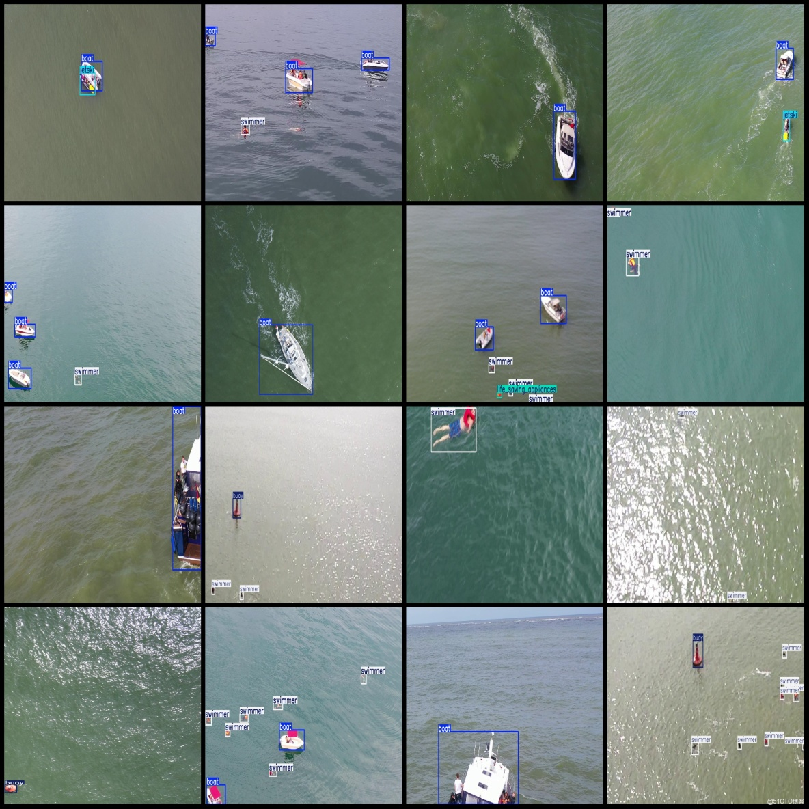

# Drone Perspective Swimming Detection Dataset: VOC+YOLO Format with 20604 Images in 5 Categories

Dataset Format: Pascal VOC format + YOLO format (txt files without split paths, only including jpg images and corresponding VOC format xml files and yolo format txt files)
Number of Images (jpg file count): 20604
Number of Annotations (xml file count): 20604
Number of Annotations (txt file count): 20604
Number of Classifications: 5
Classification Label Names according to the order in the yolo format (not consistent with this order, but refer to the labels folder's classes.txt for accuracy): [“boat”, “buoy”, “jetski”, 
“life_saving_appliances”, “swimmer”]
Box Count per Category:
boat boxes = 13339
buoy boxes = 3772
jetski boxes = 1929
life_saving_appliances boxes = 729
swimmer boxes = 37177
Total Boxes: 56946
Annotation Tool Used: labelImg
Annotation Rules: Draw rectangle boxes for categories
Compression Size: 3.15GB
Important Notice: No guarantee is made regarding the accuracy or weights of the trained models using this dataset. This dataset provides accurate and reasonable annotations.
Distribution Chart of Image Resizing:
Image Preview:
Annotation Example:

## Images

Here is a pay link on Stripe ( https://buy.stripe.com/3cs8yP7sY87d0vu9AB ). Please contact me lonlonago@foxmail.com after funding $89, and I will send you a complete data files , thank you!

